# Service Booking Platform — Layered Architecture & Integration Blueprint

This document details the layered technical architecture, full API contracts, autonomous agent tool schemas, event streaming pipeline (Apache Kafka), consumer workers, and webhooks across the entire service booking lifecycle.

---

## 1. Excalidraw-Ready Architecture Diagram

```mermaid
flowchart TD
    %% =========================================================================
    %% LAYER 1: FRONTEND LAYER
    %% =========================================================================
    subgraph L1 ["1. FRONTEND LAYER"]
        FE_USER["Customer Portal (/user) - Chat, Cards, Book, Cancel"]
        FE_STAFF["Staff Portal (/staff) - Queue Monitor, Accept, Reject, Finalize"]
        FE_ADMIN["Merchant Portal (/merchant) - BYOK, Catalogs, Docs, Force Cancel"]
    end

    %% =========================================================================
    %% LAYER 2: ORCHESTRATOR & API GATEWAY LAYER
    %% =========================================================================
    subgraph L2 ["2. ORCHESTRATOR GATEWAY LAYER (FastAPI)"]
        API_GW["API Gateway and Router - /chat, /bookings, /cancel, /upload"]
        AUTH_SVC["Auth and RBAC Engine - JWT and Token Verification"]
        STREAM_BUS["Realtime Event Bus - SSE Stream and WS Broadcaster"]
        KAFKA_PROD["Kafka Event Producer - booking.events topic"]
    end

    %% =========================================================================
    %% LAYER 3: AGENT, TOOLS & KAFKA CONSUMER WORKERS
    %% =========================================================================
    subgraph L3 ["3. AGENT TOOLS AND KAFKA CONSUMER WORKERS"]
        AGENT_CORE["LLM Reasoning Agent - Intent and Tool Caller (Gemini/OpenAI)"]
        
        T_CATALOG["Tool: catalogue_search - Filter services and pricing"]
        T_KNOWLEDGE["Tool: kb_semantic_search - Search policies and FAQs"]
        T_BOOKING["Tool: create_booking - Slot reserve and token generation"]
        T_CANCEL["Tool: cancel_booking - Slot release and status update"]
        T_INGEST["Tool: ingest_documents - Chunking and vectorization"]
        
        CG_WA["WhatsApp Consumer Worker - Meta Cloud Templates"]
        CG_SMS["SMS Consumer Worker - Twilio and SNS Alerts"]
        CG_EMAIL["Email Consumer Worker - SendGrid and ICS Invites"]
        CG_AUDIT["Audit and Analytics Consumer - Event Ledger"]
    end

    %% =========================================================================
    %% LAYER 4: PERSISTENCE, EVENT LOG & EXTERNAL SERVICES
    %% =========================================================================
    subgraph L4 ["4. PERSISTENCE AND EXTERNAL COMM LAYER"]
        DB_PG[("PostgreSQL RDBMS - Bookings, Staff, Services, Audit Logs")]
        DB_MILVUS[("Milvus Vector DB - Knowledge and Catalog Embeddings")]
        DB_REDIS[("Redis - Session Memory, Locks, De-duplication")]
        DB_S3[("Object Storage (S3/MinIO) - Raw Documents and Images")]
        
        LOG_KAFKA[("Apache Kafka / Redpanda - booking.lifecycle.v1 topic")]
        
        EXT_WA["WhatsApp Cloud API - Template Confirmation and Buttons"]
        EXT_SMS["SMS Gateway (Twilio/SNS) - Short-code Token and Alert"]
        EXT_EMAIL["Email Gateway (SendGrid/Resend) - ICS Calendar Invite"]
    end

    %% =========================================================================
    %% FLOW: FRONTEND -> ORCHESTRATOR
    %% =========================================================================
    FE_USER -->|"POST /chat, /bookings, /cancel"| API_GW
    FE_ADMIN -->|"POST /upload, /config, /override"| API_GW
    FE_STAFF -->|"POST /login, PATCH /decision"| AUTH_SVC
    AUTH_SVC -->|"Authenticated Action"| API_GW

    %% =========================================================================
    %% FLOW: ORCHESTRATOR -> AGENT & TOOLS
    %% =========================================================================
    API_GW -->|"Enriched Prompt + Session"| AGENT_CORE
    API_GW -->|"Document Ingestion Job"| T_INGEST

    AGENT_CORE -->|"Invoke"| T_CATALOG
    AGENT_CORE -->|"Invoke"| T_KNOWLEDGE
    AGENT_CORE -->|"Invoke"| T_BOOKING
    AGENT_CORE -->|"Invoke"| T_CANCEL

    %% =========================================================================
    %% FLOW: TOOLS -> PERSISTENCE
    %% =========================================================================
    T_CATALOG -->|"SQL Query"| DB_PG
    T_BOOKING -->|"INSERT status: pending/confirmed"| DB_PG
    T_CANCEL -->|"UPDATE status: cancelled"| DB_PG
    T_KNOWLEDGE -->|"Vector Search"| DB_MILVUS
    T_INGEST -->|"Upsert Vectors"| DB_MILVUS
    T_INGEST -->|"Store Raw Files"| DB_S3
    AGENT_CORE -->|"Save Turn State"| DB_REDIS

    %% =========================================================================
    %% FLOW: KAFKA EVENT STREAMING & CONSUMERS
    %% =========================================================================
    API_GW -->|"Publish Event: BookingCreated/Cancelled"| KAFKA_PROD
    KAFKA_PROD -->|"Append Immutable Log"| LOG_KAFKA

    LOG_KAFKA -->|"Group: whatsapp-dispatchers"| CG_WA
    LOG_KAFKA -->|"Group: sms-dispatchers"| CG_SMS
    LOG_KAFKA -->|"Group: email-dispatchers"| CG_EMAIL
    LOG_KAFKA -->|"Group: analytics-audit"| CG_AUDIT

    CG_WA -->|"Dispatch Template"| EXT_WA
    CG_SMS -->|"Dispatch SMS"| EXT_SMS
    CG_EMAIL -->|"Dispatch Email + ICS"| EXT_EMAIL
    CG_AUDIT -->|"Write Audit Log"| DB_PG

    %% =========================================================================
    %% OUTBOUND REALTIME PUSH TO CLIENTS
    %% =========================================================================
    DB_PG -.->|"PG NOTIFY: booking_state_change"| STREAM_BUS
    STREAM_BUS -.->|"SSE Live Token Stream"| FE_USER
    STREAM_BUS -.->|"WebSocket Live Event"| FE_STAFF
```



---

## 2. Comprehensive Inventory by Layer

### Layer 1: Frontends
| Persona / App | Path | Primary Responsibilities |
| :--- | :--- | :--- |
| **Customer Portal** | `/user` | Conversational booking interface, real-time SSE token streaming, interactive service chips, customer self-cancellation. |
| **Staff Portal** | `/staff` | Specialist dispatch queue, live WebSocket ticket feed, claim unassigned tickets, accept/reject, add notes, and finalize bookings. |
| **Merchant Admin** | `/merchant` | Admin controls, BYOK LLM key storage (AES-256), custom system prompts, document/catalog drag-and-drop ingestion, live booking ledger with force-cancellation override. |

---

### Layer 2: Orchestrator & API Gateway (FastAPI)

#### Inbound REST Endpoints
| Method & Path | Access Control | Request Body / Params | Response Payload | Purpose |
| :--- | :--- | :--- | :--- | :--- |
| `POST /api/v1/user/chat` | Session Cookie / Open | `{"session_id": "str", "message": "str"}` | SSE chunk stream | Customer prompt input; triggers agent reasoning turn. |
| `POST /api/v1/user/bookings` | Session Token | `{"service_id": "uuid", "customer_name": "str", "phone": "str", "slot": "iso8601"}` | `{"booking_id": "uuid", "verification_token": "str", "status": "pending"}` | Direct booking creation without LLM. |
| `POST /api/v1/user/bookings/{id}/cancel` | Verification Token Header | `{"token": "str", "reason": "str | None"}` | `{"status": "cancelled_by_user", "cancelled_at": "iso8601"}` | Customer self-cancellation. |
| `POST /api/v1/auth/login` | Public Credentials | `{"username": "str", "password": "str"}` | `{"access_token": "jwt", "role": "staff|admin"}` | Issues scoped Bearer JWT token. |
| `PATCH /api/v1/staff/bookings/{id}/decision` | Bearer JWT (`role: staff`) | `{"action": "accept | reject", "reason": "str | None"}` | `{"booking_id": "uuid", "status": "accepted | cancelled_by_staff"}` | Specialist accepts or rejects/cancels ticket. |
| `PATCH /api/v1/staff/bookings/{id}/finalize` | Bearer JWT (`role: staff`) | `{"service_notes": "str", "final_amount": "float"}` | `{"booking_id": "uuid", "status": "finalized"}` | Finalizes completed appointment. |
| `POST /api/v1/admin/catalog/upload` | Bearer JWT (`role: admin`) | Multipart: `file: catalog.xlsx`, `images: images.zip` | `{"services_parsed": 120, "job_id": "uuid"}` | Batch parses Excel/CSV catalog and optimizes WebP images. |
| `POST /api/v1/admin/knowledge/upload` | Bearer JWT (`role: admin`) | Multipart: `file: policy.pdf` | `{"doc_id": "uuid", "chunks": 42, "status": "indexed"}` | Extracts text, chunks, and indexes into Milvus. |
| `PATCH /api/v1/admin/config` | Bearer JWT (`role: admin`) | `{"provider": "gemini|openai", "api_key": "str", "prompt": "str"}` | `{"status": "updated"}` | Encrypts API key with AES-256-GCM and persists prompt. |
| `DELETE /api/v1/admin/bookings/{id}` | Bearer JWT (`role: admin`) | `{"cancellation_reason": "str"}` | `{"status": "cancelled_by_merchant"}` | Emergency store override cancellation. |

#### Real-Time Streaming & WebSockets
| Protocol & Path | Direction | Payload Structure | Purpose |
| :--- | :--- | :--- | :--- |
| `GET /api/v1/user/chat/stream` | Server &rarr; Client (SSE) | `data: {"type": "token", "content": "..."}` or `data: {"type": "card", "service": {...}}` | Streams chunked LLM response tokens and interactive UI cards. |
| `WS /api/v1/staff/live-queue` | Server &rarr; Client (WebSocket) | `{"event": "NEW_BOOKING | CANCELLED", "booking": {...}}` | Real-time push stream notifying active staff specialists. |

#### Webhook Handlers
| Route / Trigger | Direction | Source | Purpose |
| :--- | :--- | :--- | :--- |
| `POST /api/v1/webhooks/whatsapp` | Inbound | Meta Cloud API | Captures delivery statuses (`sent`, `delivered`, `read`) and interactive quick-reply button selections. |
| `POST /api/v1/webhooks/sms` | Inbound | Twilio / AWS SNS | Processes SMS delivery receipts and customer opt-out callbacks (`STOP`, `UNSUBSCRIBE`). |
| `pg_notify('booking_state_change')` | Internal | PostgreSQL Trigger | Fires on any `INSERT` or `UPDATE` on `bookings` table, notifying Gateway listeners immediately. |

---

### Layer 3: Agent, Tool Registry & Kafka Consumer Groups

#### Agent Tool Registry (OpenAI / Gemini Function Signatures)
```python
# 1. Catalog Search Tool
def catalogue_search(
    query: str, 
    category: str | None = None, 
    max_price: float | None = None
) -> list[dict]:
    """Filters active services and pricing from PostgreSQL."""
    ...

# 2. Policy Semantic Search Tool
def kb_semantic_search(
    query: str, 
    top_k: int = 4, 
    score_threshold: float = 0.72
) -> list[dict]:
    """Encodes query via all-MiniLM-L6-v2 and searches Milvus vector store for policy/FAQ chunks."""
    ...

# 3. Create Booking Tool
def create_booking(
    service_id: str, 
    customer_name: str, 
    phone: str, 
    slot_time: str
) -> dict:
    """Inserts booking into DB (status: pending) and returns generated verification token."""
    ...

# 4. Cancel Booking Tool
def cancel_booking(
    booking_id: str, 
    verification_token: str, 
    reason: str
) -> dict:
    """Validates token, releases staff slot, and marks booking cancelled_by_user."""
    ...

# 5. Ingest Documents Tool
def ingest_documents(
    doc_id: str, 
    file_path: str, 
    merchant_id: str
) -> dict:
    """Extracts text, segments into 512-word chunks (10% overlap), and indexes in Milvus."""
    ...
```

#### Apache Kafka Event Producer & Schema
Topic: `booking.lifecycle.v1` (Key: `merchant_id` or `booking_id`)
```json
{
  "event_id": "evt_9841fbc",
  "event_type": "BOOKING_CREATED | BOOKING_CANCELLED | BOOKING_FINALIZED",
  "timestamp": "2026-09-17T14:00:00Z",
  "data": {
    "booking_id": "b78a2d1e-8e43-41bb-98a2",
    "verification_token": "BK-9841",
    "merchant_id": "m_102",
    "customer_name": "Jane Doe",
    "customer_phone": "+1234567890",
    "customer_email": "jane@example.com",
    "service_name": "Full Synthetic Oil Change",
    "slot_time": "2026-09-18T10:00:00Z",
    "status": "pending",
    "cancellation_reason": null
  }
}
```

#### Kafka Independent Consumer Groups
```python
# Consumer Group 1: whatsapp-notification-workers
async def consume_whatsapp_events():
    """Reads booking.lifecycle.v1, sends WhatsApp Cloud API template with interactive action buttons."""
    async for msg in kafka_consumer(topic="booking.lifecycle.v1", group_id="whatsapp-notification-workers"):
        event = json.loads(msg.value)
        await whatsapp_client.send_template(event["data"])

# Consumer Group 2: sms-notification-workers
async def consume_sms_events():
    """Reads booking.lifecycle.v1, sends Twilio/SNS SMS alert with verification token short-code."""
    async for msg in kafka_consumer(topic="booking.lifecycle.v1", group_id="sms-notification-workers"):
        event = json.loads(msg.value)
        await sms_client.send_token(event["data"])

# Consumer Group 3: email-notification-workers
async def consume_email_events():
    """Reads booking.lifecycle.v1, sends SendGrid/Resend confirmation email with .ics calendar invite."""
    async for msg in kafka_consumer(topic="booking.lifecycle.v1", group_id="email-notification-workers"):
        event = json.loads(msg.value)
        await email_client.send_calendar_invite(event["data"])

# Consumer Group 4: analytics-audit-workers
async def consume_audit_events():
    """Appends all booking lifecycle state changes into long-term audit and BI storage."""
    async for msg in kafka_consumer(topic="booking.lifecycle.v1", group_id="analytics-audit-workers"):
        await audit_repo.record_event(msg.value)
```

---

### Layer 4: Persistence, Event Log & External Gateways
- **PostgreSQL 16**: Primary relational storage for `bookings`, `services`, `categories`, `staff`, `merchants`, and `audit_log`. Houses triggers for `pg_notify`.
- **Milvus Vector DB**: Vector indices for dense search:
  - `kb_policy_collection` (384-dim, HNSW index).
  - `catalog_semantic_collection` (384-dim, IVF_FLAT index).
- **Apache Kafka / Redpanda**: Distributed event streaming platform hosting `booking.lifecycle.v1` log. Handles multi-consumer fan-out, horizontal partition scalability, and message replayability.
- **Redis 7.2**:
  - Multi-turn conversation history cache for LangGraph / StateGraph agents.
  - Distributed lock manager (`Redlock`) to guarantee mutual exclusion on booking slots.
  - Idempotency key cache for Kafka consumers to prevent duplicate notification delivery.
- **Object Storage (S3 / MinIO)**: Storage for uploaded PDF/DOCX policy documents and converted WebP service catalog images.
- **External Communications**:
  - **WhatsApp Cloud API**: Formatted rich templates with interactive Action buttons (`Confirm`, `Cancel`).
  - **Twilio / AWS SNS**: SMS short-code delivery for offline token verification.
  - **SendGrid / Resend**: Transactional emails with embedded ICS calendar invitations and deep links.

---

## 3. End-to-End Execution Sequence Blueprints

### Blueprint A: Booking Creation & Kafka Event Fan-Out

```
[Customer] ──── POST /user/chat ("Book AC Service for tomorrow 11am, Jane, +123456789") ────► [FastAPI Gateway]
                                                                                                    │
                                                                                    (Context & Tool Spec)
                                                                                                    ▼
                                                                                              [LLM Agent]
                                                                                                    │
                                                                           (Invoke tool: create_booking)
                                                                                                    ▼
[PostgreSQL] ◄─── INSERT INTO bookings (status='pending', token='BK-8821') ────────────── [Tool Execution]
      │
(PG Trigger: NOTIFY booking_state_change)
      ▼
[Event Bus] ──── (1. Push WebSocket Ticket) ──────────────────────────────────────────────► [/staff Portal]
      │
      └───────── (2. Publish BookingCreated Event) ────────────────────────────────────────► [Kafka Topic: booking.lifecycle.v1]
                                                                                                 │
                                      ┌──────────────────────────────────────────────────────────┼──────────────────────────────────────────────────────────┐
                                      ▼                                                          ▼                                                          ▼
                          [Group: whatsapp-workers]                                    [Group: sms-workers]                                      [Group: email-workers]
                                      │                                                          │                                                          │
                                      ▼                                                          ▼                                                          ▼
                            [WhatsApp Cloud API]                                            [Twilio SMS]                                       [SendGrid / Resend]
                            (Interactive Template)                                      (Short-code BK-8821)                                  (ICS Calendar Invite)
```

### Blueprint B: Tri-Party Cancellation Lifecycle via Kafka

```
1. Initiation:
   - User:      POST /user/bookings/{id}/cancel    (Supplies Verification Token BK-8821)
   - Staff:     PATCH /staff/bookings/{id}/decision (action='reject', reason='Specialist unavailable')
   - Merchant:  DELETE /admin/bookings/{id}        (reason='Store emergency closure')

2. Orchestration:
   - FastAPI verifies permissions / verification token.
   - Executes atomic SQL update: status = 'cancelled_*', frees specialist slot.

3. Event Streaming:
   - PostgreSQL executes NOTIFY booking_state_change -> pushes live WS update to /staff.
   - FastAPI publishes BookingCancelled event to Kafka topic `booking.lifecycle.v1`.
   - Independent Kafka Consumer Groups (WhatsApp, SMS, Email) read the cancellation event:
     ├── WhatsApp Consumer calls Meta Cloud API to send cancellation template.
     ├── SMS Consumer sends text confirmation with reason.
     └── Email Consumer delivers cancellation notice and retracts calendar invite.
```
