# Orchestrator-Centric Omnichannel Service Booking Platform Workflow

## 1. System Architecture & High-Level Routing

All interactions from the frontends (`/user`, `/staff`, `/merchant`) and external webhooks are strictly routed through an **API Orchestrator (FastAPI Gateway)**. The orchestrator mediates between storage layers (PostgreSQL & Milvus Vector DB), the Context Builder, the LLM Reasoning Engine (with Function/Tool Calling), and real-time push events (WebSockets / Webhooks).

```
+----------------------------------------------------------------------------------------------------+
|                                           FRONTENDS                                                |
|   +-----------------------+     +------------------------+     +-------------------------------+   |
|   |  /user (Customer)     |     |  /staff (Specialists)  |     |  /merchant (Store Admin)      |   |
|   |  - Conversational UI  |     |  - Auth Login          |     |  - BYOK LLM & Prompt Config   |   |
|   |  - Live SSE / Stream  |     |  - Real-Time Bookings  |     |  - Knowledge Base (PDF/Docs)  |   |
|   |  - Token & Cards      |     |  - Accept / Reject     |     |  - XLSX/CSV & Image Uploads   |   |
|   +-----------+-----------+     +-----------+------------+     +---------------+---------------+   |
+---------------|-----------------------------|----------------------------------|-------------------+
                | (HTTP / SSE / WS)           | (Bearer JWT / WS)                | (Bearer JWT / Multi-part)
                v                             v                                  v
+----------------------------------------------------------------------------------------------------+
|                                   ORCHESTRATOR (FastAPI Gateway)                                    |
|  - Unified Auth & RBAC Engine (Customer session / Staff JWT / Merchant Admin)                      |
|  - Tool Call Dispatcher (/catalogue-show, /booking-confirm)                                        |
|  - Dynamic Context Builder (Merges session history, DB records, semantic chunks, and tool schemas)|
|  - Real-time Event Broadcaster (WebSockets & Postgres LISTEN/NOTIFY -> Staff Webhook Event)        |
+--------------------+---------------------+---------------------+-----------------------------------+
                     |                     |                     |
         +-----------v----------+   +------v-------+   +---------v------------+
         |      PostgreSQL      |   |    Milvus    |   |     LLM Engine       |
         | - Staff & Merchant   |   |  Vector DB   |   |  (OpenAI / BYOK)     |
         | - Catalog & Services |   | - RAG Docs   |   | - Tool Caller        |
         | - Bookings & Tokens  |   | - Semantic   |   | - Token Streaming    |
         | - LISTEN / NOTIFY    |   |   Catalog    |   +----------------------+
         +----------------------+   +--------------+
```

---

## 2. End-to-End Mermaid Workflow Diagram

```mermaid
flowchart TD
    %% =========================================================================
    %% FRONTENDS
    %% =========================================================================
    subgraph Frontends ["Frontends Layer"]
        FE_USER["/user (Customer Web/Mobile)"]
        FE_STAFF["/staff (Staff Portal)"]
        FE_MERCHANT["/merchant (Merchant Admin)"]
    end

    %% =========================================================================
    %% ORCHESTRATOR
    %% =========================================================================
    subgraph Orchestrator ["Orchestrator Gateway (FastAPI)"]
        O_ROUTER{"Route Dispatcher"}
        O_AUTH["Auth & Session Validator"]
        O_TOOL_DISPATCH{"Tool Calling Router"}
        O_CTX["Context Builder Engine"]
        O_STREAM["SSE / Token Streamer"]
        O_EVENT_BUS["Realtime Event Bus & Webhook Dispatcher"]
    end

    %% =========================================================================
    %% DATA & ENGINE LAYER
    %% =========================================================================
    subgraph Persistence ["Persistence & Retrieval Layer"]
        PG[(PostgreSQL: RDBMS)]
        MILVUS[(Milvus: Vector DB)]
        S3[(Object Storage: S3 / MinIO)]
    end

    subgraph Intelligence ["AI / LLM Engine"]
        LLM["LLM Agent (BYOK Model)"]
    end

    %% Routing
    FE_USER -- "1. POST /chat (Prompt/Session)" --> O_ROUTER
    FE_STAFF -- "Credentials / Bearer Token" --> O_AUTH
    FE_MERCHANT -- "Configs, Documents, Catalogs" --> O_AUTH

    O_AUTH --> O_ROUTER

    %% -------------------------------------------------------------------------
    %% 1. USER CHAT & CATALOGUE FLOW
    %% -------------------------------------------------------------------------
    O_ROUTER -- "User Chat Request" --> O_CTX
    O_CTX -- "Fetch Recent History & Merchant Profile" --> PG
    O_CTX -- "Build Initial Prompt + Tool Declarations" --> LLM

    LLM -- "Decides Intent: Browse / Search" --> O_TOOL_DISPATCH
    O_TOOL_DISPATCH -- "Tool: /catalogue-show" --> MILVUS
    O_TOOL_DISPATCH -- "Fetch Active Services & Categories" --> PG
    
    PG & MILVUS -- "Matching Records / Embeddings" --> O_CTX
    O_CTX -- "Enriched Context (User Query + DB Results)" --> LLM
    LLM -- "Stream Response Tokens" --> O_STREAM
    O_STREAM -- "Live Token Stream & Catalogue UI Cards" --> FE_USER

    %% -------------------------------------------------------------------------
    %% 2. USER BOOKING CONFIRMATION & TOKEN GENERATION
    %% -------------------------------------------------------------------------
    FE_USER -- "User Requests Booking (Slots/Details)" --> O_ROUTER
    O_ROUTER -- "Pass Booking Context" --> LLM
    LLM -- "Invoke Tool: /booking-confirm (Payload)" --> O_TOOL_DISPATCH
    
    O_TOOL_DISPATCH -- "Validate & Insert Booking (status='pending')" --> PG
    PG -- "Generated Booking ID & Token (UUID/Short-code)" --> O_TOOL_DISPATCH
    
    O_TOOL_DISPATCH -- "Booking Details + Token" --> O_CTX
    O_CTX --> LLM
    LLM -- "Formatted Confirmation Stream" --> O_STREAM
    O_STREAM -- "Booking ID, Verification Token & Summary" --> FE_USER

    %% -------------------------------------------------------------------------
    %% 3. POSTGRES TRIGGER & REALTIME WEBHOOK TO STAFF
    %% -------------------------------------------------------------------------
    PG -- "PG Trigger: NOTIFY new_booking_channel" --> O_EVENT_BUS
    O_EVENT_BUS -- "Webhook / WebSocket Event: New Booking" --> FE_STAFF

    %% -------------------------------------------------------------------------
    %% 4. STAFF AUTH & DASHBOARD LIFECYCLE
    %% -------------------------------------------------------------------------
    FE_STAFF -- "POST /auth/login (staff creds)" --> O_AUTH
    O_AUTH -- "Verify Hash against staff table" --> PG
    PG -- "Valid Credentials" --> O_AUTH
    O_AUTH -- "Issue JWT & Grant Access" --> FE_STAFF
    FE_STAFF -- "Staff Action (Accept/Reject)" --> O_ROUTER
    O_ROUTER -- "Update Booking Status & Reassign/Finalize" --> PG

    %% -------------------------------------------------------------------------
    %% 5. MERCHANT MANAGEMENT & KNOWLEDGE BASE CONFIGURATION
    %% -------------------------------------------------------------------------
    FE_MERCHANT -- "POST /auth/login (admin creds)" --> O_AUTH
    
    %% Config API & Prompts
    FE_MERCHANT -- "PATCH /admin/config (API Key, Prompt)" --> O_ROUTER
    O_ROUTER -- "Encrypt API Key & Store Prompts" --> PG

    %% Unstructured Knowledge Docs
    FE_MERCHANT -- "POST /admin/knowledge (PDF/DOCX)" --> O_ROUTER
    O_ROUTER -- "Store Raw Document" --> S3
    O_ROUTER -- "Chunk & Generate Embeddings" --> MILVUS

    %% Tabular Catalog & Images
    FE_MERCHANT -- "POST /admin/catalog/upload (.xlsx/.csv + images.zip)" --> O_ROUTER
    O_ROUTER -- "Save Product Images" --> S3
    O_ROUTER -- "Batch Upsert Categories & Services" --> PG
    O_ROUTER -- "Embed Service Catalog Vectors" --> MILVUS
```



---

## 3. Workflow Specifications & Sub-Systems

### A. User Conversational Interface (`/user`)

1. **Chat & Catalogue Discovery (`/catalogue-show`)**:
   - **Inbound**: User sends query to Orchestrator endpoint `POST /api/v1/orchestrator/chat`.
   - **Context Builder**: Pulls merchant settings, chat history from PostgreSQL, and formats available tool calls.
   - **Reasoning**: LLM evaluates query:
     - If the user asks for available services, treatments, or recommendations, LLM calls `/catalogue-show`.
     - Orchestrator queries Milvus for semantic similarity or PostgreSQL for active categories/services.
     - Results feed back into the Context Builder.
   - **Streaming**: LLM generates formatted suggestions, streaming tokens (SSE) back to `/user` with interactive service cards.

2. **Booking Confirmation & Token Generation (`/booking-confirm`)**:
   - **Inbound**: User provides service choice, full name, phone number, and optional note.
   - **Tool Execution**: LLM triggers `/booking-confirm` with validated arguments.
   - **Persistence**: Orchestrator opens a PostgreSQL transaction:
     - Computes a cryptographically random **Booking Verification Token** (e.g., short-code + UUID).
     - Selects assigned staff via round-robin pool.
     - Saves record to `bookings` table with status `pending`.
   - **Outbound**: Orchestrator sends booking token and reservation summary to Context Builder, and LLM delivers confirmation response to the user chat.

---

### B. Staff Portal & Real-time Webhook Dispatcher (`/staff`)

1. **Authentication Flow (`/auth`)**:
   - Staff lands on `/staff/login` and submits credentials.
   - Orchestrator checks Bcrypt password hash against `staff` table in PostgreSQL.
   - Upon verification, orchestrator generates a scoped JWT token (`role: staff`, `staff_id`, `merchant_id`).
   - Staff panel loads assigned queue and active booking lists.

2. **Real-time Webhook / WebSocket Push Notification**:
   - When a booking row is inserted in PostgreSQL (`INSERT INTO bookings`), a PostgreSQL Trigger executes `pg_notify('new_booking_event', payload)`.
   - Orchestrator listener picks up the event immediately.
   - Orchestrator dispatches a WebSocket notification / webhook payload directly to the active `/staff` panel.
   - The staff member sees the incoming request with user details, requested service, and customer notes in real time.

---

### C. Merchant Administration Portal (`/merchant`)

The Merchant panel shares staff authentication security but adds admin capabilities:

1. **LLM BYOK & System Prompt Configuration**:
   - Set custom model endpoints (e.g., GPT-4o, Claude, local models).
   - AES-256-GCM encrypted storage for API keys in PostgreSQL.
   - Custom System Prompts: Tone of voice, business rules, refund policies.

2. **Unstructured Knowledge Base Ingestion**:
   - Merchant uploads policy PDFs, service manuals, or FAQ documents (`.pdf`, `.docx`).
   - Files stored in S3/MinIO.
   - Orchestrator extracts text, segments into 512-token chunks (with 10% overlap), generates dense embeddings, and indexes them in **Milvus** (`merchant_knowledge_idx`).

3. **Tabular Catalog & Asset Management**:
   - Merchant uploads `.xlsx` or `.csv` spreadsheet with matching product/service images (`.zip` or direct uploads).
   - Images compressed to WebP and saved in S3 (`merchants/{id}/services/{uuid}.webp`).
   - Batch database insertion into `categories` and `services` in PostgreSQL.
   - Semantic embeddings generated for each service (`name + description + pricing`) and indexed in **Milvus** (`catalog_semantic_idx`).

---

## 4. API & Tool Route Matrix

| Route / Tool Name | Caller | Target Service | Purpose |
| :--- | :--- | :--- | :--- |
| `POST /api/v1/orchestrator/chat` | `/user` | Orchestrator -> LLM | Initiates customer chat session with SSE token streaming |
| `tool://catalogue-show` | LLM Engine | Orchestrator -> PG & Milvus | Retrieves matching category and service details |
| `tool://booking-confirm` | LLM Engine | Orchestrator -> PostgreSQL | Commits booking transaction and generates verification token |
| `POST /api/v1/auth/login` | `/staff`, `/merchant` | Orchestrator -> PostgreSQL | Validates credentials and returns scoped JWT |
| `WS /api/v1/staff/live-bookings` | `/staff` | Orchestrator (PG Notify) | Real-time push stream for newly confirmed pending bookings |
| `PATCH /api/v1/merchant/config` | `/merchant` | Orchestrator -> PostgreSQL | Updates agent prompt and BYOK LLM credentials |
| `POST /api/v1/merchant/knowledge`| `/merchant` | Orchestrator -> S3 & Milvus | Ingests PDF/Docx documents into vector embeddings |
| `POST /api/v1/merchant/catalog`  | `/merchant` | Orchestrator -> PG, S3 & Milvus | Parses Excel/CSV catalog and images into database and vector store |
