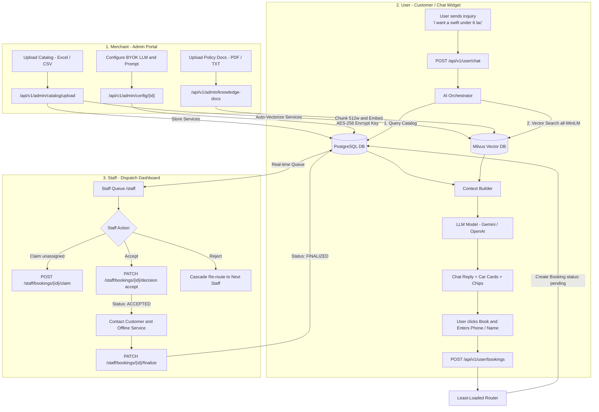

# Service Booking Platform — Current 3-End Workflow

This document outlines the workflow across the three distinct personas:
1. **Merchant (Admin)**: Sets up catalog, knowledge docs, and AI keys.
2. **User (Customer)**: Interacts with the AI widget, browses services, and creates bookings.
3. **Staff (Specialist)**: Receives, claims, accepts/rejects, and finalizes bookings.

---

## High-Level 3-End Architecture

---

## 1. Merchant (Admin) Workflow

The merchant controls the business configuration via `/admin`:

1. **Catalog Ingestion**:
   - Merchant uploads an Excel/CSV file with columns: `name`, `category`, `price_range`, `description`.
   - Backend auto-creates categories and services in PostgreSQL and vectorizes items into Milvus.
2. **Policy & Knowledge Ingestion**:
   - Merchant uploads PDF/TXT/MD documents (e.g., test-drive rules, store timings, warranty terms).
   - Backend chunks text into 512-word windows, embeds using `sentence-transformers/all-MiniLM-L6-v2`, and stores dense vectors in Milvus.
3. **AI & BYOK Configuration**:
   - Merchant inputs their LLM API key (Gemini, OpenAI, Claude, or Groq) and custom system prompt.
   - API key is encrypted at rest using AES-256-GCM.

---

## 2. User (Customer) Workflow

The customer interacts via the embeddable floating chat widget or web app:

1. **Conversational Inquiry**:
   - User types an inquiry (e.g., *"Show cars under 8 lakhs"* or *"Do I need a license for a test drive?"*).
   - Frontend calls `POST /api/v1/user/chat`.
2. **Dual-Path Orchestration**:
   - **Catalog path**: Checks PostgreSQL for matching models and budget ranges.
   - **Knowledge path**: Converts query into a 384-dim vector and searches Milvus for policy chunks.
   - **Context Builder**: Combines catalog results + document policies + conversation history into a structured prompt.
   - **LLM Call**: Model generates a natural answer accompanied by interactive Service Cards and suggestion chips.
3. **Booking Creation**:
   - User selects a service and enters full name, phone number, and optional notes.
   - Frontend calls `POST /api/v1/user/bookings`.
   - Router assigns the ticket to the least-loaded staff specialist. Status becomes `pending`.

---

## 3. Staff (Operator) Workflow

Specialists manage customer requests through `/staff`:

1. **Queue Monitoring**:
   - Staff views pending tickets assigned directly to them or unassigned in the merchant pool.
2. **Decision (Accept / Reject / Claim)**:
   - **Claim**: If ticket is unassigned, any merchant specialist can claim it.
   - **Accept**: Moves status to `accepted`. Staff contacts the customer to confirm time and paperwork.
   - **Reject**: Staff provides a reason (e.g., *"Schedule conflict"*). The system round-robin cascades the booking to the next available specialist.
3. **Finalize**:
   - After completing the in-person appointment or test drive, staff logs completion notes and marks the ticket `finalized`.
