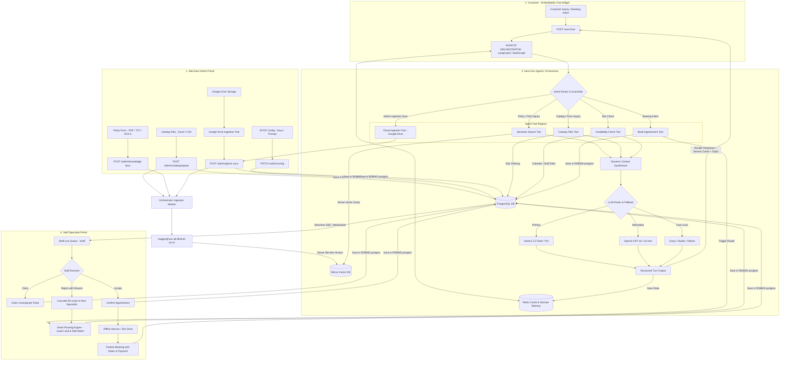

# Service Booking Platform — Improved Agentic Architecture & Workflow

This document outlines the **Next-Gen Agentic Architecture** featuring an explicit **Agentic Orchestrator (LangGraph / StateGraph)**, an autonomous **Tool Registry**, multi-turn **Redis Session Memory**, and a dynamic **Multi-Model LLM Engine**.

---

## Improved System Architecture

---

## Key Improvements Over Previous Architecture

| Area | Previous Architecture | Improved Agentic Architecture |
| :--- | :--- | :--- |
| **Orchestration** | Hardcoded if-else code in `/chat` endpoint | **Stateful Agentic Orchestrator (LangGraph StateGraph)** with intent classification and guardrails. |
| **Tool Calling** | Monolithic inline functions | **Modular Tool Registry** (`Semantic Search`, `Catalog Filter`, `Availability Check`, `Book Appointment`). |
| **Session Memory** | Short in-memory history slice passed from client | **Persistent Redis Session Memory & State Management** for uninterrupted multi-turn conversations. |
| **LLM Routing** | Single hardcoded provider lookup | **Adaptive LLM Router with Auto-Fallback** (Gemini &rarr; OpenAI &rarr; Groq). |
| **Ingestion** | Manual upload only | **Multi-Source Ingestion** (Excel/CSV, PDF/DOCX, and Google Drive Cloud Sync). |
| **Staff Dispatch** | Polling-based queue refresh | **Event-Driven Dispatch** via WebSocket/SSE with automatic round-robin cascading. |
